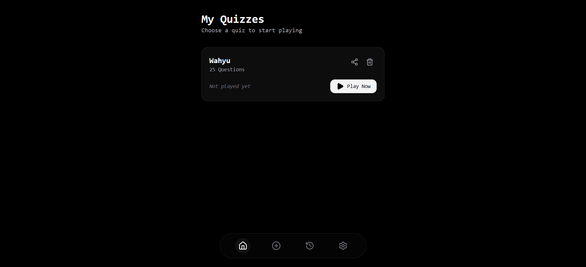

# Quiz Interface

This platform provides a streamlined interface for creating, managing, and participating in interactive quizzes. It enables users to build custom question sets, track their progress through session history, and evaluate results using a dedicated review system.

Built with React and TypeScript, the project leverages Redux for robust state management. While kuis creation and gameplay are powered by local storage for a fast, offline-capable experience, the platform also features a **Shared Quiz** system.

Using a backend powered by **Hono** and **Cloudflare D1**, users can generate unique shareable links for their quizzes. These links use SHA-256 content hashing to ensure data integrity and prevent collisions, allowing quizzes to be easily distributed across the web and imported by other users into their local lists.
